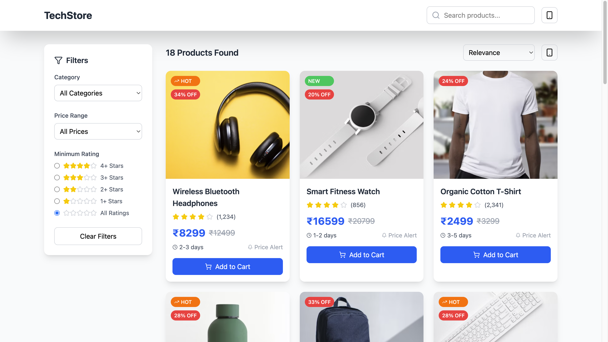
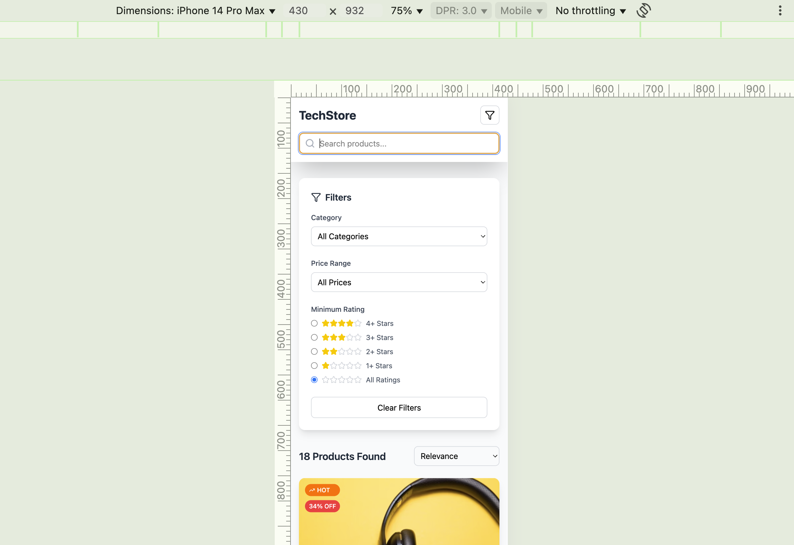

# 🛒 TechStore - E-Commerce Product Listing App

A modern e-commerce product listing interface where users can search, filter, and explore tech products. Built with React and designed to work smoothly across desktop and mobile devices.

---

## ✨ Features

- 🔍 **Search Bar** with instant filtering
- 🧰 **Category, Price, and Rating Filters**
- 📱 **Responsive Design** (Mobile + Desktop)
- 📊 **Product Cards** with:
  - Discounts
  - Ratings
  - Delivery info
  - “Add to Cart” buttons
- 📦 Static mock data (ideal for frontend practice)

---

## ScreenRecord


## 🖼️ Screenshots

### 💻 Desktop View  


### 📱 Mobile View  


>  Place these two screenshots inside a folder called `screenshots/` in your GitHub repo for them to render.

---

## ⚙️ Tech Stack

- React.js (with Hooks)
- Tailwind CSS
- Responsive design (CSS Flex & Grid)
- JavaScript & JSX
- Font Awesome / Icon Libraries

---

## 🚀 Getting Started

### 1. Clone the Repository
```bash
git clone https://github.com/S-Vignesh-Programmer/RISE-Internship-Ecomm.git
cd TechStore


2. Install Dependencies

npm install


3. Start the Development Server

npm run dev


Author

Vignesh java Full Stack Developer
For RISE Internship Project Submission

License

This project is licensed for learning and portfolio use.
Feel free to improve and extend the features!